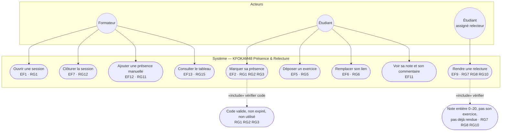

# D1 — Cas d'utilisation

> Le relecteur n'est pas un acteur distinct : c'est un étudiant assigné à une relecture (décision de modélisation, §2 du cahier des charges).

```mermaid
graph TB
    subgraph Acteurs
        F(("Formateur"))
        E(("Étudiant"))
        R(("Étudiant<br/>assigné relecteur"))
    end

    subgraph Systeme["Système — KFOKAM48 Présence & Relecture"]
        UC1([Ouvrir une session<br/>EF1 · RG1])
        UC2([Clôturer la session<br/>EF7 · RG12])
        UC3([Ajouter une présence manuelle<br/>EF12 · RG11])
        UC4([Consulter le tableau<br/>EF13 · RG15])
        UC5([Marquer sa présence<br/>EF2 · RG1 RG2 RG3])
        UC6([Déposer un exercice<br/>EF5 · RG5])
        UC7([Remplacer son lien<br/>EF6 · RG6])
        UC8([Voir sa note et son commentaire<br/>EF11])
        UC9([Rendre une relecture<br/>EF9 · RG7 RG8 RG10])
    end

    F --> UC1
    F --> UC2
    F --> UC3
    F --> UC4
    E --> UC5
    E --> UC6
    E --> UC7
    E --> UC8
    R --> UC9

    UC5 -.->|"«include» vérifier code"| V1([Code valide, non expiré, non utilisé<br/>RG1 RG2 RG3])
    UC9 -.->|"«include» vérifier"| V2([Note entière 0–20, pas son exercice,<br/>pas déjà rendue · RG7 RG8 RG10])
```
