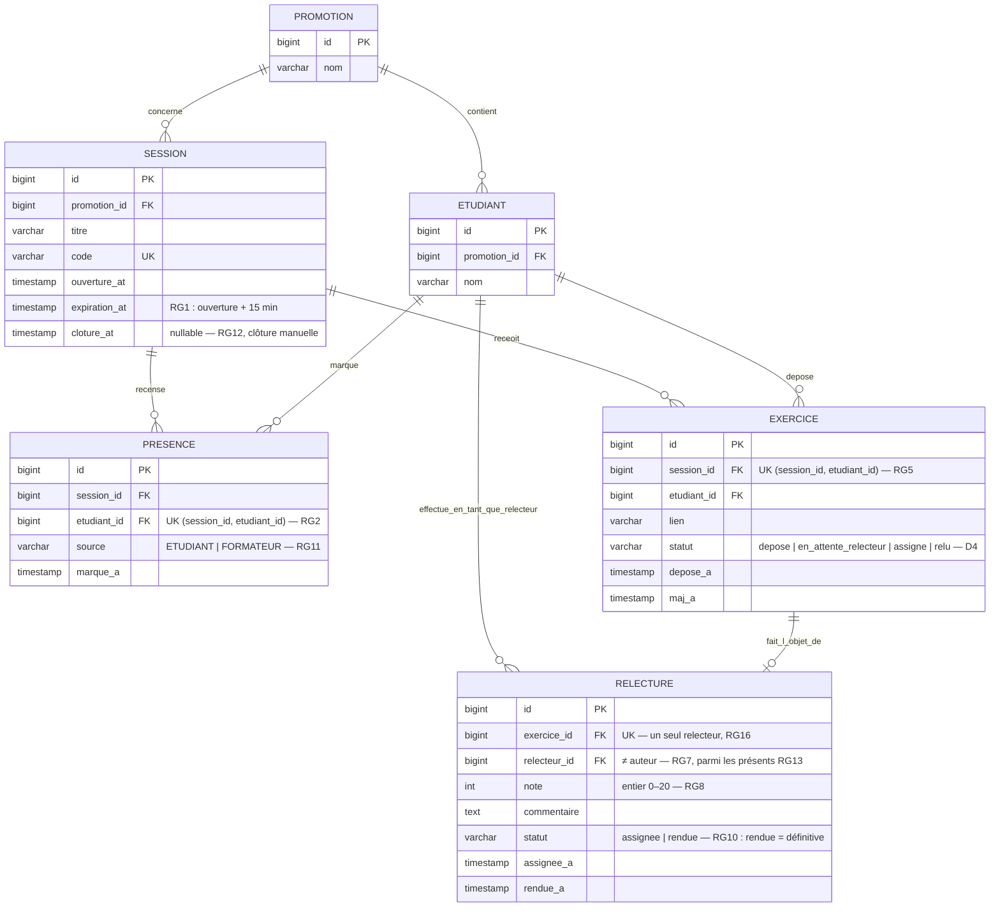

# D2 — Modèle de données (classes)

> Ce diagramme doit rester cohérent avec les migrations Flyway de l'étape 2. Toute évolution du schéma passe par une migration **et** une mise à jour de ce diagramme (sujet, étape 3).

**Notes de conception :**

- Unicité `(session_id, etudiant_id)` sur `PRESENCE` (RG2) et sur `EXERCICE` (RG5) : garantie en base par contrainte d'unicité, pas seulement dans le service.
- `SESSION.cloture_at` est nullable : `NULL` = session ouverte (le dépôt reste possible, Q12), renseigné = clôturée (RG12).
- `RELECTURE.relecteur_id` porte le choix aléatoire (RG13) : le relecteur est un étudiant, pas un acteur distinct (§2).
- La note n'existe que sur `RELECTURE` ; la moyenne du tableau (EF13) est calculée côté API (F3).
