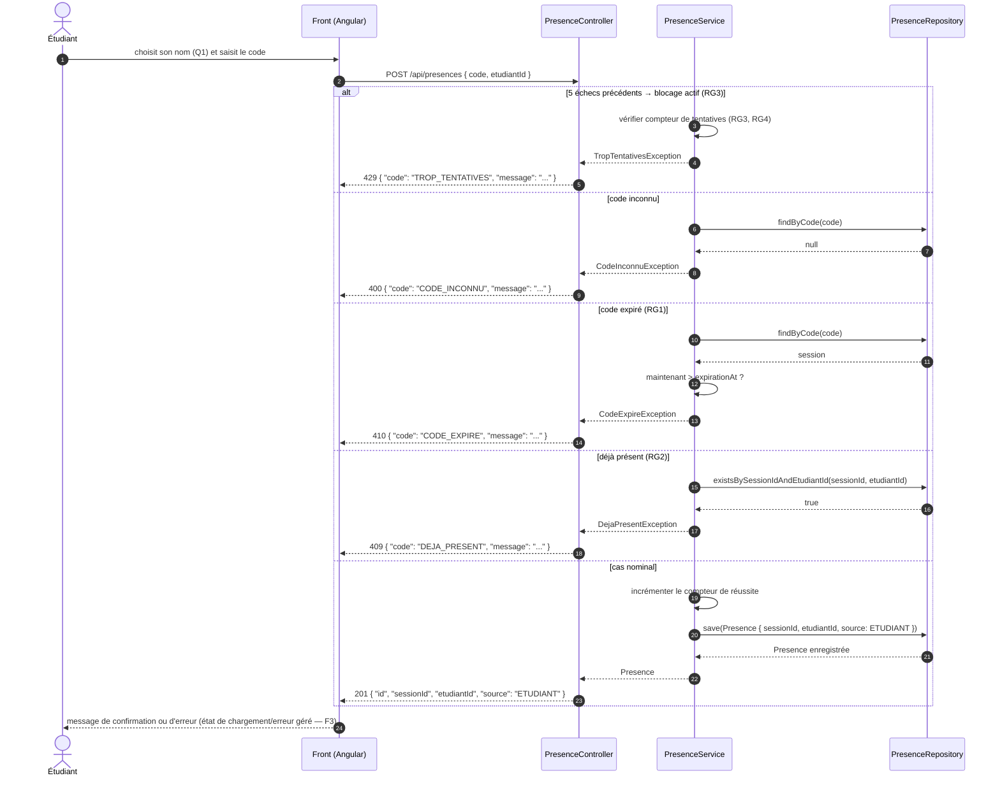

# D3 — Séquence : marquer sa présence

> Codes HTTP conformes au contrat imposé : `201` succès, `400` code inconnu, `409` déjà présent, `410` code expiré, `429` blocage après 5 échecs (RG3, ajouté par le client Q4). Format d'erreur `{ code, message }` partout (B4).

**Points de contrôle de conformité :**

- Chaque branche d'erreur renvoie exactement le format imposé `{ code, message }`, jamais de stack trace (B4).
- `410 CODE_EXPIRE` vérifie `expirationAt` issu de RG1 — cohérence avec D2 et avec le contrat.
- L'ordre des vérifications est : blocage → code inconnu → code expiré → déjà présent → enregistrement.
