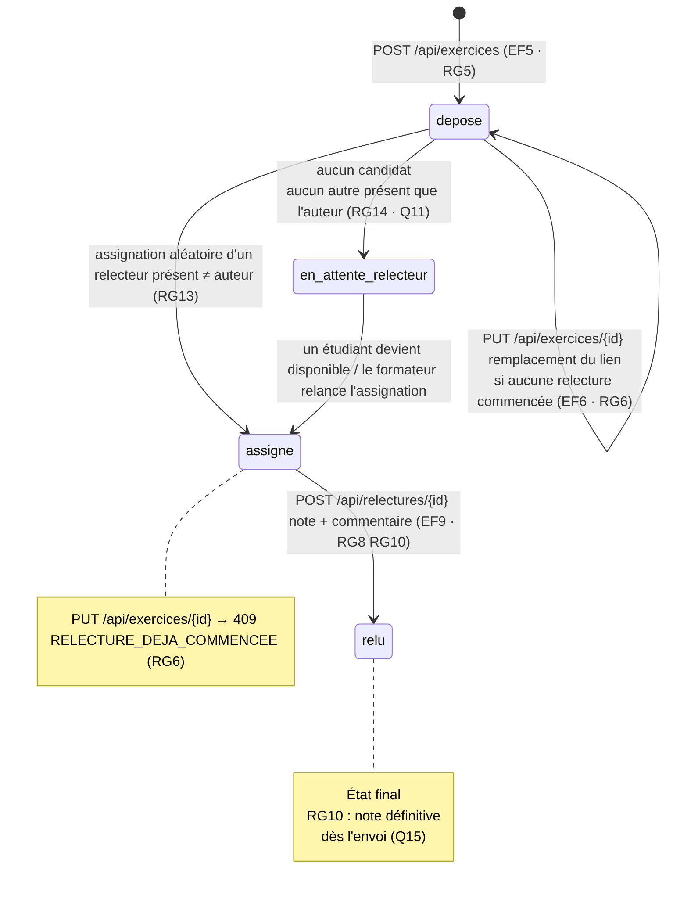

# D4 — États-transitions : cycle de vie d'un exercice (bonus)

> États de `EXERCICE.statut` (D2). Ce diagramme est le bonus du sujet (+3).

**Transitions et leurs règles :**

| Transition | Déclencheur | Règles |
|---|---|---|
| `[*] → depose` | `POST /api/exercices` | RG5 : un seul exercice par étudiant et par session (`409 EXERCICE_DEJA_DEPOSE`) |
| `depose → en_attente_relecteur` | Assignation impossible | RG14 : aucun étudiant présent autre que l'auteur ; visible dans le tableau (Q11) |
| `depose → assigne` | Assignation automatique | RG13 : au hasard parmi les présents, hors auteur (RG7) |
| `en_attente_relecteur → assigne` | Un candidat devient disponible | RG13, RG14 |
| `assigne → relu` | `POST /api/relectures/{id}` | RG8 note entière 0–20, RG7 pas son propre exercice, RG10 définitive |
| `depose → depose` (auto) | `PUT /api/exercices/{id}` | RG6 : tant que personne n'a relu ; après, `409 RELECTURE_DEJA_COMMENCEE` |
